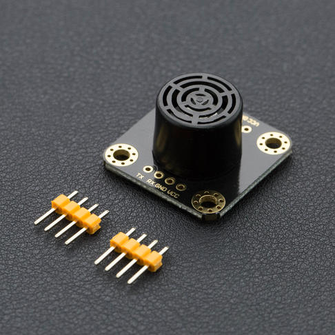

# DFRobot_URM07
- [中文版](./README_CN.md)

An ultrasonic sensor measures distance by calculating the time difference between sending a signal and receiving an echo from an object.

The URM07 is an ultra-low-power ultrasonic ranging sensor. The effective range is up to 7.5m, and it has a wide range power supply of 3.0 - 5.5V. And it is directly compatible with 3.3V or 5V devices such as Arduino, Raspberry Pi, etc. The average operating current is only 5mA and the standby current is only 14uA, so most of the controller IO ports can provide operating current for single or multiple URM07 modules. According to the principle of ultrasound sensors, the accuracy of the distance will be affected by air temperature and wind direction, and the DFRobot URM07 with a built-in temperature sensor allows reading the ambient temperature and automatically compensating for the data.

The sensor uses a transceiver integrated ultrasonic probe with a detection angle of approximately 60° in a compact and lightweight unit. The unit uses a 2.54mm pitch 4Pin interface and UART communication, adapting to more system architectures for secondary development and applications. URM07-UART ultrasonic distance sensors have undertaken rigorous measuring and optimization. We guarantee that this sensor has first-class response speed, ultra high stability and sensitivity, and ultra low power consumption. 



## Product Link(https://www.dfrobot.com/product-1057.html)

SKU:SEN0153

## Table of Contents

* [Summary](#summary)
* [Installation](#installation)
* [Methods](#methods)
* [Compatibility](#compatibility)
* [History](#history)
* [Credits](#credits)

## Summary

This ultrasonic sensor is compatible with all Arduino platforms.

## Installation

To use this library download the zip file, uncompress it to a folder named DFRobot_URM07.
Download the zip file first to use this library and uncompress it to a folder named DFRobot_URM07.


## Methods

```C++
    /**
     * @fn gainDistance
     * @brief Get the distance between the sensor and the object ahead
     * @return uint16_t the distance between the sensor and the object ahead
     */
    uint16_t gainDistance(void);

    /**
     * @fn gainTemperature
     * @brief Get sensor board temp
     * @return float board temp
     */
    float gainTemperature(void);

    /**
     * @fn changeBaudreat
     * @brief Change serial communication baud rate
     * @param baud_reat baud rate
     * @n     BAUD_REAT_1200BPS 
     * @n     BAUD_REAT_2400BPS 
     * @n     BAUD_REAT_4800BPS 
     * @n     BAUD_REAT_9600BPS 
     * @n     BAUD_REAT_14400BPS 
     * @n     BAUD_REAT_19200BPS 
     * @n     BAUD_REAT_28800BPS 
     * @n     BAUD_REAT_38400BPS 
     * @n     BAUD_REAT_57600BPS 
     * @n     BAUD_REAT_115200BPS
     * @n     BAUD_REAT_128000BPS
     * @n     BAUD_REAT_256000BPS
     */
    void changeBaudreat(uint8_t baud_reat);

    /**
     * @fn  changeAddr
     * @brief Change the default address of the sensor
     * @param addr the address to be changed
     */
    void changeAddr(uint8_t addr);
```
## Compatibility

MCU                | Work Well | Work Wrong | Untested  | Remarks
------------------ | :----------: | :----------: | :---------: | -----
FireBeetle-ESP32  |      √       |             |            | 
FireBeetle-ESP8266|      √       |              |             | 
Mega2560  |      √       |             |            | 
Arduino uno |       √      |             |            | 
Leonardo  |      √       |              |             | 
Micro：bit  |      √       |              |             | 
M0  |      √       |              |             | 

## History

- 2022/3/14 - 1.0.0 version 

## Credits

Written by PengKaixing(kaixing.peng@dfrobot.com), 2021. (Welcome to our [website](https://www.dfrobot.com/))
